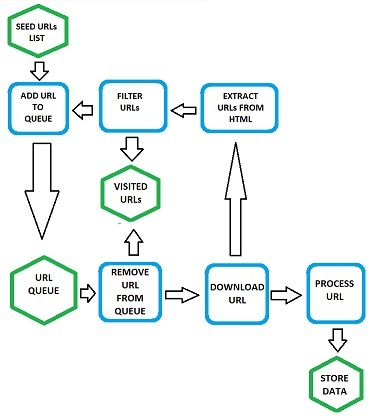
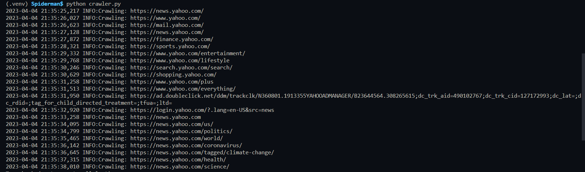

# Python Web Crawler

## Description

This is a basic web crawler, and it's the first one I've made. It's built with Python 🐍 and its dependencies are `bs4` and `requests`.
I created this to test the general mechanism of a web crawler, and it has a lot of room for improvement, outlined below:
 

***Please note:*** because this is a very basic crawler, it completely ignores `robots.txt` files, which are meant to instruct crawlers on how to operate on a particular site.  It also doesn't support parallelism, it takes ~1 sec to crawl each URL, and each time the crawler sends a request, it simply waits for the response and doesn't do anything else. It's not very efficient with a high number of URLS, doesn't remove query string parameters from the URLs, and doesn't handle relative or fragmented URLs.

## Basic Structure:

## Usage
1. clone repo:
`git clone https://github.com/jroller33/Spiderman.git`

2. create a virtual environment:
`python3 -m venv crawler`

3. install dependencies in the venv:
`pip install requests bs4`

4. decide what URL you want to start on, and add it to line 50:
`Crawler(urls=['  <URL GOES HERE>  ']).run()`

5. in your terminal, run:
`python crawler.py`

6. the crawler will log one line for each visited URL in your terminal:

### Sample Crawler Log for Yahoo News:

## Contribution
You can contribute by forking this [repo](https://github.com/jroller33/Spiderman) and submitting a pull request.

## License
This project is licensed under the [MIT License](./LICENSE).

## Contact
[GitHub](https://github.com/jroller33)

