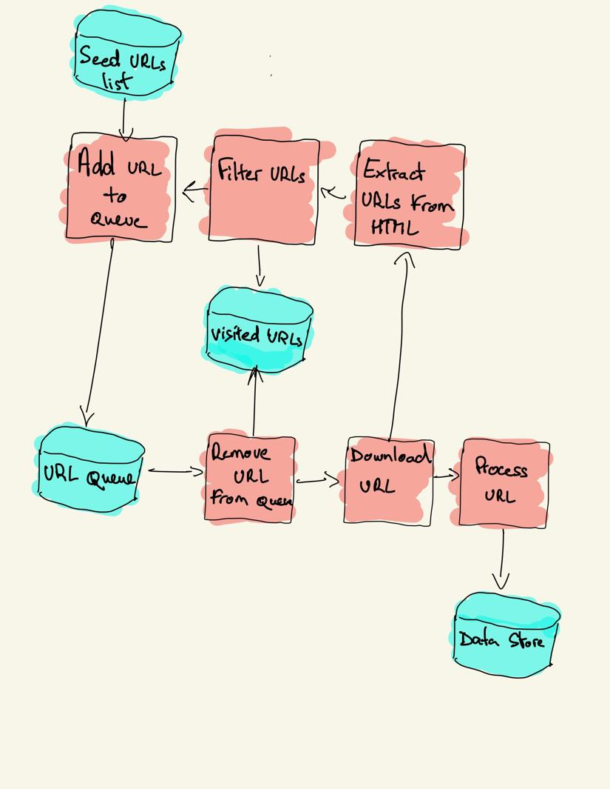

# Python Web Crawler

## Description

This is a basic web crawler, and it's the first one I've made. It's built with Python 🐍 and its dependencies are `bs4` and `requests`.

## Table of Contents
- [Usage](#usage)
- [Structure](#structure)
- [Contribution](#contribution)
- [License](#license)
- [Contact](#contact)

## Usage

### Structure:

## Contribution
You can contribute by forking this [repo](https://github.com/jroller33/Spiderman) and submitting a pull request.

## License
This project is licensed under the [MIT License](./LICENSE).

## Contact
[GitHub](https://github.com/jroller33)

